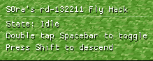

# Ancient Fly

A fly hack for Minecraft pre-classic **rd-132211** (released May 13, 2009).




## Quick Start

Download the latest binaries from the [releases page](https://github.com/S0raWasTaken/Ancient-Fly/releases/latest).

### Usage

1. Launch Minecraft `rd-132211`
2. Run the injector:
   ```sh
   1nject.exe javaw.exe fly_rd_132211.dll
   ```

### Controls

| Key | Action |
|-----|--------|
| Double tap Space | Toggle fly mode |
| Space (Hold) | Ascend |
| Shift | Descend |

## Building from Source

### Prerequisites
- Rust toolchain (MSVC target for Windows)
- Windows SDK

### Build
```sh
cargo build --release
```

Outputs:
- `target/release/1nject.exe` - DLL injector
- `target/release/fly_rd_132211.dll` - Fly hack DLL

## About the injector

The injector is a universal DLL injector that uses the classic `LoadLibraryA` technique. It can target processes by name or PID:

```sh
# By process name
1nject.exe javaw.exe path\to\your.dll

# By PID
1nject.exe 1234 path\to\your.dll
```

You may as well use any other DLL injector if you wish.

## License

[MIT](/LICENSE)
